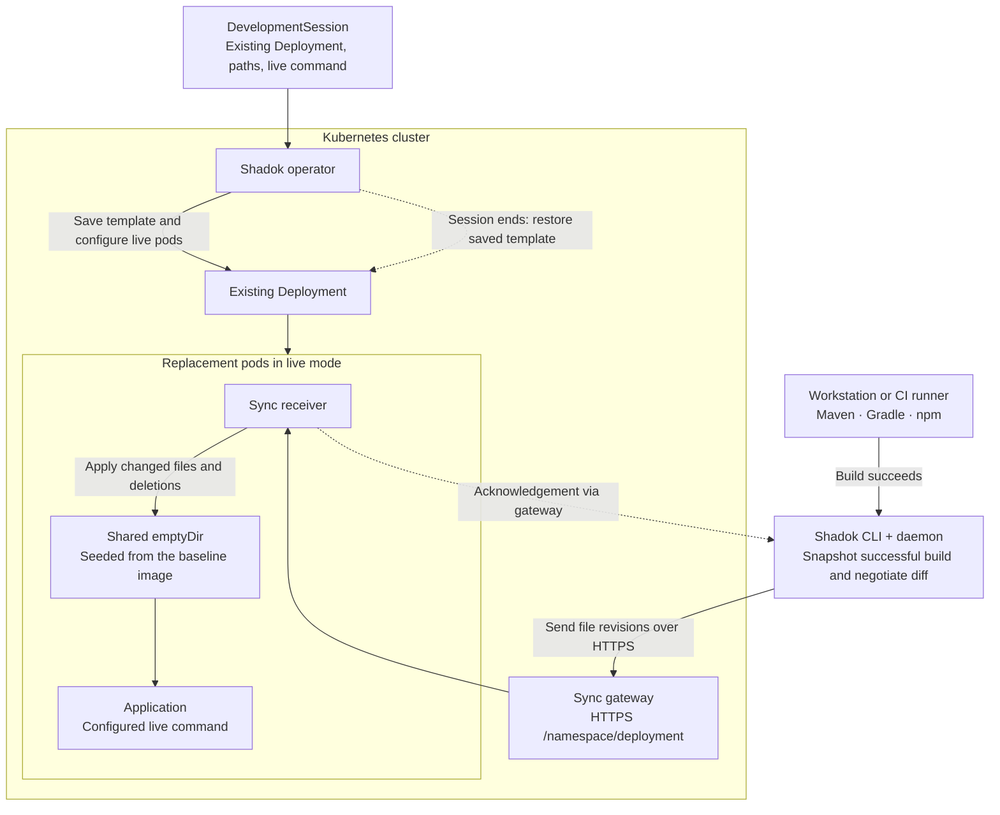

<p align="center">
  
</p>

# Shadok

**Turn your existing Kubernetes application into a live development environment.**

Keep the Deployment your platform already delivers through Helm or Helmfile: its configuration, resources and Service routing. Activate a development session, build on your workstation or a CI runner, and send changed files into the running application. End the session to restore the saved Pod template. No duplicate deployment configuration on the developer's machine; no Kubernetes credentials in the synchronization client.

The platform installs Shadok once. Developers can be granted access only to `DevelopmentSession` resources; the operator handles workload changes with its own permissions. Each application declares the directories and live command it needs.

## How it works



The operator prepares the live environment; it does not compile the application or transport the build files. An init container copies configured paths from the baseline image into shared volumes before the application starts with its live command. Subsequent file updates use those volumes, without rebuilding the application image for every edit. The application's own runtime handles reload or restart.

## Operating guides for application agents

Choose one complete guide and work in your application's repository. Each includes inspection of the production image, required YAML files, activation, build/sync, HTTP reload checks and restoration. No sample checkout is required.

| Application | Guide | Offline command |
| --- | --- | --- |
| Spring Boot JVM | [Spring Boot](operator-go/internal/guidance/topics/spring.md) | `shadok learn spring` |
| Quarkus JVM | [Quarkus](operator-go/internal/guidance/topics/quarkus.md) | `shadok learn quarkus` |
| Node.js / TypeScript / Vite | [Node](operator-go/internal/guidance/topics/node.md) | `shadok learn node` |
| Python | [Python](operator-go/internal/guidance/topics/python.md) | `shadok learn python` |

## Platform administration

- [Install Shadok](operator-go/internal/guidance/topics/install.md): operator, gateway and chart.
- [Expose the gateway](operator-go/internal/guidance/topics/network.md): DNS, TLS, Ingress and destination.
- [Upgrade](operator-go/internal/guidance/topics/upgrade.md): CLI and cluster installation.
- [Restore and delete sessions](operator-go/internal/guidance/topics/lifecycle.md).

Run `shadok learn` for the offline index or `shadok chart export ./shadok-chart` to export the matching chart.

## Develop and verify

Requires Go 1.26+, Helm and Docker. Kind and kubectl are needed for Kubernetes integration tests.

```sh
make -C operator-go generate verify
make -C operator-go chart-test
make -C operator-go local-e2e
make -C operator-go generic-images
./scripts/cluster-up.sh
./scripts/deploy-operator.sh
```

The local scripts explicitly target `shadok-go-e2e`; they preserve an existing cluster and do not install demo applications implicitly.

## Repository guides

- [CLI and operator overview](operator-go/README.md)
- [Helm chart configuration and lifecycle](operator-go/chart/README.md)
- [Packaging and distribution](docs/DISTRIBUTION.md)
- [Operator review](docs/OPERATOR_REVIEW.md)
- [Validation evidence](docs/VALIDATION.md)
- [Local HTTPS ingress integration](docs/LOCAL_INGRESS.md)
- [Daemon and build contract](docs/DAEMON_BUILD_CONTRACT.md)
- [Application examples](pods/README.md)

The API is `v1alpha1`. Protect the gateway through a trusted network or an authenticated ingress; built-in writer authentication is not implemented. File synchronization acknowledgements and application reload verification are separate checks. Local validation does not imply a published release.

Shadok is licensed under the [MIT License](LICENSE).

For Spring Boot, follow the [production-to-DevTools live walkthrough](operator-go/internal/guidance/topics/spring.md) and [real reload evidence](docs/SPRING_LAYERED_IMAGE_VALIDATION.md). `shadok learn spring` includes the walkthrough.

This Spring scenario keeps its production image and load DevTools from a platform-mounted read-only volume: [same-image live proof](docs/SPRING_LAYERED_IMAGE_VALIDATION.md).

See the [complete gateway networking guide](operator-go/internal/guidance/topics/network.md) for platform exposure, daemon destination settings and diagnostics. Run `shadok learn network` to read it in the CLI.

## Updating Shadok

Use `shadok upgrade cli` and `shadok upgrade cluster --context CONTEXT --namespace shadok-system --release shadok`. See the [upgrade guide](operator-go/internal/guidance/topics/upgrade.md) for checksums, Helm values preservation, backups and dry runs.

Session deletion does not wait for a Shadok finalizer: see [live deletion validation](docs/SESSION_DELETION_VALIDATION.md).
