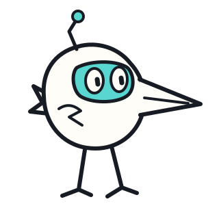
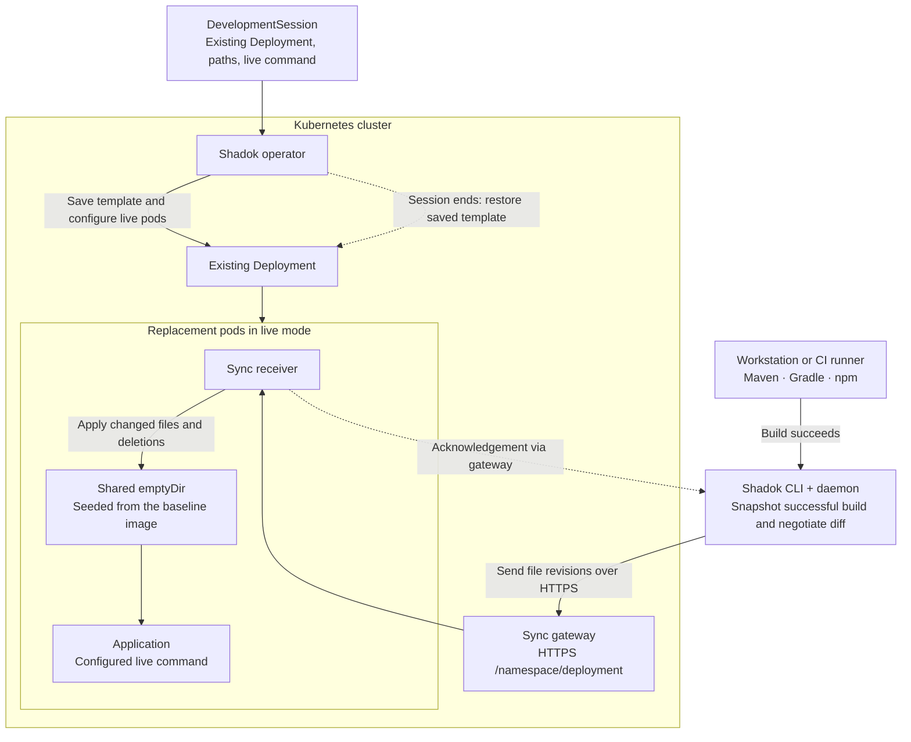

<p align="center">
  
</p>

# Shadok

**Turn your existing Kubernetes application into a live development environment.**

Keep the Deployment your platform already delivers through Helm or Helmfile: its configuration, resources and Service routing. Activate a development session, build on your workstation or a CI runner, and send changed files into the running application. End the session to restore the saved Pod template. No duplicate deployment configuration on the developer's machine; no Kubernetes credentials in the synchronization client.

The platform installs Shadok once. Developers can be granted access only to `DevelopmentSession` resources; the operator handles workload changes with its own permissions. Each application declares the directories and live command it needs.

## How it works



The operator prepares the live environment; it does not compile the application or transport the build files. An init container copies configured paths from the baseline image into shared volumes before the application starts with its live command. Subsequent file updates use those volumes, without rebuilding the application image for every edit. The application's own runtime handles reload or restart.

### From a successful build to a live update

A workstation or CI job uses the same CLI. For example, after configuring a `service` build group in `shadok.yaml`:

```sh
shadok build --config shadok.yaml --group service \
  --url https://sync.example.com --namespace dev --deployment orders \
  -- mvn verify
```

Replace the final command with your Gradle or npm build. The CLI starts or reuses its daemon, captures an immutable snapshot **only after success**, sends changed files and deletions, and waits for acknowledgement. A failed build leaves the last published revision intact. This is a stream of file revisions, not a stream of container images. For source-driven runtimes, `shadok watch` follows the configured source directories instead.

The runner needs the CLI, the project configuration and network access to the gateway. The target session must already be active. A persistent daemon keeps reconciling the latest snapshot after a pod replacement; an ephemeral CI runner must publish again if its daemon and retained state are gone. Acknowledgement confirms file delivery, not that the application has reloaded: verify its response separately. See the [build contract](docs/DAEMON_BUILD_CONTRACT.md) for the details.

## Operator and runtime

Shadok enables live development on an **existing Kubernetes Deployment**. The Go operator saves its original Pod template, injects temporary directories and a synchronization receiver, and restores the template when the session ends. Existing Services and routing remain usable.

`DevelopmentSession` describes a container, directories, a start command, and an optional development image. Runtime and framework behavior belongs to the application image, not an operator language catalog. The CLI and daemon send files over HTTP(S) through the gateway; builds remain local and failed builds are not published. The daemon requires no Kubernetes credentials.

Install a published version using the [release installation guide](docs/INSTALL_RELEASE.md): GitHub CLI downloads, GHCR Helm installation, Kind setup and application configuration.

## Start with the binary

```sh
shadok --help
shadok learn
shadok docs install
```

Operational guidance is embedded in the executable. It covers cluster installation, configuration, source watching, successful-build hooks, verification, troubleshooting and restoration. Use `shadok chart export ./shadok-chart` to materialize the bundled chart without a source checkout. Registry images must be explicitly selected from a release you trust; documentation does not assume an unpublished public registry exists.

## Develop and verify

Requires Go 1.26+, Helm and Docker. Kind and kubectl are needed for Kubernetes integration tests.

```sh
make -C operator-go generate verify
make -C operator-go chart-test
make -C operator-go local-e2e
make -C operator-go generic-images
./scripts/cluster-up.sh
./scripts/deploy-operator.sh
```

The local scripts explicitly target `shadok-go-e2e`; they preserve an existing cluster and do not install demo applications implicitly.

## Repository guides

- [CLI and operator overview](operator-go/README.md)
- [Helm chart configuration and lifecycle](operator-go/chart/README.md)
- [Packaging and distribution](docs/DISTRIBUTION.md)
- [Operator review](docs/OPERATOR_REVIEW.md)
- [Validation evidence](docs/VALIDATION.md)
- [Local HTTPS ingress integration](docs/LOCAL_INGRESS.md)
- [Daemon and build contract](docs/DAEMON_BUILD_CONTRACT.md)
- [Application examples](pods/README.md)

The API is `v1alpha1`. Protect the gateway through a trusted network or an authenticated ingress; built-in writer authentication is not implemented. File synchronization acknowledgements and application reload verification are separate checks. Local validation does not imply a published release.

Shadok is licensed under the [MIT License](LICENSE).

For Spring Boot, follow the [production-to-DevTools live walkthrough](operator-go/internal/guidance/topics/spring.md) and [real reload evidence](docs/SPRING_LIVE_VALIDATION.md). The walkthrough is included as `shadok learn spring` in the next rebuilt CLI; published 1.0.0 predates this topic.

Spring can also keep its production image and load DevTools from a platform-mounted read-only volume: [same-image live proof](docs/SPRING_VOLUME_VALIDATION.md).
